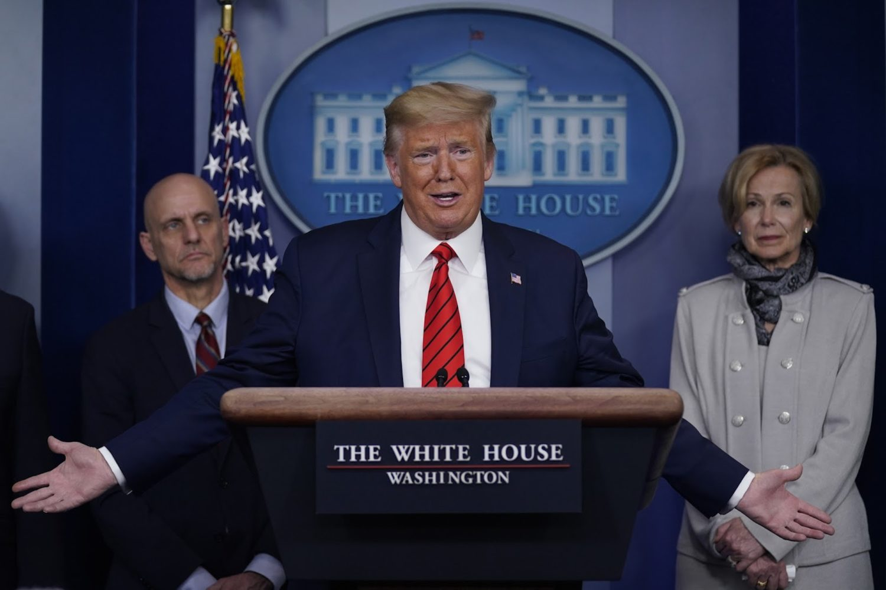

## Exploring President Trump's Daily Task Force Briefings with Emotion Analysis and Topic Modelling

President Donald Trump speaking during a press briefing with the coronavirus task force on March 19, 2020. (AP Photo/Evan Vucci)

Given the controversy over the Trump administration's [daily briefings](https://www.nytimes.com/2020/04/09/us/politics/trump-coronavirus-press-briefing.html?referringSource=articleShare) and overall [handling of the COVID-19 pandemic](https://www.nytimes.com/2020/04/14/us/politics/coronavirus-trump-who-funding.html), I thought it would be interesting to apply some of the basic NLP techniques I recently learned to explore this timely, readily available body of text. The analysis below examines all of the White House's task force briefings held from 2020-02-26 to 2020-04-27.

- The draft analysis workbook can be reviewed [here](https://github.com/brendoncampbell/corona-briefing-tones/blob/master/src/briefing_analysis.ipynb).
- The scraping script used to retrieve the briefing texts can be found [here](https://github.com/brendoncampbell/corona-briefing-tones/blob/master/src/scrape_briefings.py).

